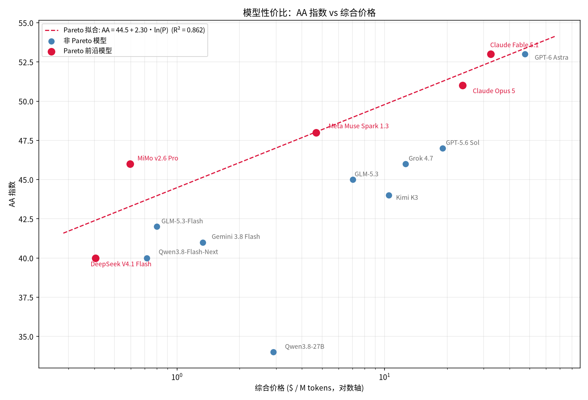

# 模型选择

数据收纳几类模型：

1. 闭源最强大模型。两个：GPT-6 Astra、Claude Fable 5.1。
2. 开源最强大模型。两个：MiMo v2.6 Pro和GLM-5.3。
3. 公司可离线部署。两个：GLM-5.3-Flash和Qwen3.8-Flash-Next。
4. 个人低成本独立部署。一个：Qwen3.8-27B。
5. 可执行任务廉价模型。一个：DeepSeek V4.1 Flash。

其中：

- 公司离线部署的线，划定在了256G统一内存上。Q4量化的话，参数量大约在300-400B以下。同时，激活参数量最好在20B以下。
- 个人低成本部署的线，划定在了32G统一内存上。Q4量化的话，参数量大约在40-50B以下。
- 可执行任务廉价模型，划定在 API 综合价格低于 $1/百万 tokens、具备 agent 或工具执行能力、且未归入上述任何类别的模型。

# 固有参数

| 模型 | 发布时间 | 开放性 | 参数量 | 激活参数量 | 多模态 | 上下文 | 下载 |
|---|---:|---:|---:|---:|---:|---:|---|
| [GPT-6 Astra](https://developers.openai.com/api/docs/models/gpt-6-astra) | 2026-09-03 | 闭 | -- | -- | V | 1M | -- |
| [GPT-5.6 Sol](https://developers.openai.com/api/docs/models/gpt-5.6-sol) | 2026-07-09 | 闭 | -- | -- | V | 1M | -- |
| [Claude Fable 5.1](https://www.anthropic.com/claude-fable-and-mythos-5-1) | 2026-09-01 | 闭 | -- | -- | V | 1M | -- |
| [Claude Opus 5](https://www.anthropic.com/news/claude-opus-5) | 2026-07-24 | 闭 | -- | -- | V | 1M | -- |
| [Gemini 3.8 Flash](https://ai.google.dev/gemini-api/docs/models/gemini-3.8-flash) | 2026-09-02 | 闭 | -- | -- | V/A | 1M | -- |
| [Grok 4.7](https://x.ai/news/grok-4-7) | 2026-09-21 | 闭 | -- | -- | V | 500k | -- |
| [Meta Muse Spark 1.3](https://research.meta.ai/blog/introducing-muse-spark-1-3) | 2026-09-02 | 闭 | -- | -- | V | 1M | -- |
| [MiMo v2.6 Pro](https://mimo.mi.com/docs/zh-CN/news/latest/v2-6) | 2026-09-21 | 开 | 1.02T | 42B | V/A | 1M | [权重](https://huggingface.co/XiaomiMiMo/MiMo-V2.6-Pro-RL) |
| [Kimi K3](https://www.kimi.com/blog/kimi-k3) | 2026-07-16 | 开 | 2.8T | 104B | V | 1M | [权重](https://huggingface.co/moonshotai/Kimi-K3) · [GGUF](https://huggingface.co/unsloth/Kimi-K3-GGUF) |
| [GLM-5.3](https://z.ai/blog/glm-5.3) | 2026-08-14 | 开 | 744B | 40B | -- | 1M | [权重](https://huggingface.co/zai-org/GLM-5.3) · [GGUF](https://huggingface.co/unsloth/GLM-5.3-GGUF) |
| [GLM-5.3-Flash](https://z.ai/blog/glm-5.3-flash) | 2026-08-26 | 开 | 320B | 18B | V | 1M | [权重](https://huggingface.co/zai-org/GLM-5.3-Flash) · [GGUF](https://huggingface.co/unsloth/GLM-5.3-Flash-GGUF) |
| [DeepSeek V4.1 Flash](https://huggingface.co/deepseek-ai/DeepSeek-V4.1-Flash) | 2026-09-10 | 开 | 552B/763B | 8B/16B | V | 1M | [权重](https://huggingface.co/deepseek-ai/DeepSeek-V4.1-Flash) |
| [Qwen3.8-Flash-Next](https://qwen.ai/blog?id=qwen3.8-flash-next) | 2026-08-26 | 开 | 180B | 6B | V | 262k | [权重](https://huggingface.co/Qwen/Qwen3.8-Flash-Next) · [GGUF](https://huggingface.co/unsloth/Qwen3.8-Flash-Next-GGUF) |
| [Qwen3.8-27B](https://qwen.ai/blog?id=qwen3.8) | 2026-08-14 | 开 | 27B | 27B | V | 262k | [权重](https://huggingface.co/Qwen/Qwen3.8-27B) · [GGUF](https://huggingface.co/unsloth/Qwen3.8-27B-GGUF) |

- 多模态列仅记录非文本输入：`V` 表示视觉（图像或视频），`A` 表示音频，`--` 表示仅支持文本输入。
- Claude Mythos 5.1 与 Claude Fable 5.1 使用同一底层模型，仅安全策略和访问范围不同；Mythos 5.1 仅通过受信任访问计划提供，因此不在表中重复计入。
- 我们目前无法百分百确认 Qwen3.8-Flash 的底层就是 Qwen3.8-Flash-Next，但是目前有很强证据证明二者是一回事。因此表格内采用 Qwen3.8-Flash-Next 的名字和固有参数、Qwen3.8-Flash 的价格，以及 Qwen3.8-Flash-Next 的 Benchmark 分数，并将其列为开源模型。
- DeepSeek V4.1 Flash 的 552B 为 backbone 参数量，激活参数为 prefill 8B / decode 16B（因果编码器-解码器架构）；另含 196B Engram 条件记忆与视觉编码器，权重合计 763B。

# API 价格

| 模型 | 输入价格 | 输出价格 | 缓存读取 | 缓存写入 | 综合价格 | 性价比 |
|---|---:|---:|---:|---:|---:|---:|
| GPT-6 Astra | \$10 | \$50 | \$1 | \$12.5 | \$47.5 | 93.4% |
| GPT-5.6 Sol | \$4 | \$20 | \$0.4 | \$5 | \$19 | 86.3% |
| Claude Fable 5.1 | \$10 | \$50 | \$0.25 | \$12.5 | \$32.5 | **95.0%** |
| Claude Opus 5 | \$5 | \$25 | \$0.5 | \$6.25 | \$23.75 | **92.7%** |
| Gemini 3.8 Flash | \$0.375 | \$1.875 | \$0.0375 | \$0.020833 | \$1.33333 | 85.5% |
| Grok 4.7 | \$2 | \$6 | \$0.5 | -- | \$12.6 | 86.0% |
| Meta Muse Spark 1.3 | \$1.25 | \$4.25 | \$0.15 | -- | \$4.675 | **94.0%** |
| MiMo v2.6 Pro | \$0.435 | \$0.87 | \$0.0036 | -- | \$0.594 | **100.0%** |
| Kimi K3 | \$3 | \$15 | \$0.3 | -- | \$10.5 | 83.0% |
| GLM-5.3 | \$1.4 | \$4.4 | \$0.26 | -- | \$7.04 | 86.5% |
| GLM-5.3-Flash | \$0.15 | \$0.5 | \$0.03 | -- | \$0.8 | 89.9% |
| DeepSeek V4.1 Flash | \$0.30 / \$0.15 | \$1.20 / \$0.60 | \$0.006 / \$0.003 | -- | \$0.405 | **88.8%** |
| Qwen3.8-Flash-Next | \$0.15 | \$0.47 | \$0.016 | \$0.2 | \$0.717 | 86.1% |
| Qwen3.8-27B | \$0.425 | \$2.55 | \$0.085 | \$0.53125 | \$2.91125 | 68.2% |

- 不参考套餐/批量折扣/限时优惠价格，表中采用官方原价。
- 综合价格按“0.1 × 输出价格 + 输入价格 + 20 × 缓存读取价格 + 缓存写入价格”计算。未提供缓存写入价格的 `--` 在本项计算中按 0 计。它表示实际载荷每处理 1M 输入 tokens 对应的真实成本：与这 1M 输入对应的输出、缓存读取和缓存写入量，分别按实际比例乘以各自单价后，与输入成本相加。
- 有峰谷价格的，综合价格按峰谷价的平均数计算。
- Grok 4.7 的 prompt ≥200K 长文档位（输入/输出/缓存读取翻倍）与 2 倍价格的 fast 变体均未计入，综合价格按 <200K 标准档计算。
- 性价比从当前表中选出“相同或更低综合价格下不存在更高 AA 指数模型”的 5 个 Pareto 前沿模型，拟合得到 `预期 AA 指数 = 44.4855 + 2.3014 × ln(综合价格)`（R² = 0.862），最后计算“实际 AA 指数 / 预期 AA 指数 × 94.1017%”。该系数按当前模型集合中的最高原始性价比归一化，使最高分恰为 100%；其余分数均落在 0–100% 区间。该拟合是当前模型集合内的相对比较，模型或价格变化后需要重新筛选 Pareto 前沿并整体重算。
- Pareto模型的性价比已经被加粗。
- 价格-AA 关系图（横轴为对数综合价格，纵轴为 AA 指数，红点为 Pareto 前沿模型，红色虚线为 Pareto 拟合线）：

  

# 指标选择

指标选择的要求是有公信力（不好刷题），有区分度（没有饱和），数据齐全（模型都有）。SWE-bench Pro 因该领域缺少更好的替代数据而保留，缺失成绩标记为 `--`。下面是几个参考指标。

- **SWE-bench Pro**：用仓库级软件工程任务衡量模型理解跨文件代码、定位问题并完成真实修改的能力。
- **SciCode**：用多个科学领域的高难编程问题衡量代码生成和算法实现能力，补足 SWE-bench Pro 偏仓库维护的视角。
- **Terminal-Bench 2.1**：用 89 项真实终端任务衡量 agent 的命令执行、环境操作、错误恢复和长流程完成能力。
- **τ³-Banking**：用银行业务中的非结构化知识库和多步工具调用，衡量 agent 检索规则、遵守约束并正确改变外部状态的能力。
- **HLE**：用 2500 道专家审核的跨学科前沿问题衡量知识与高难推理的综合能力，且当前分数尚未饱和。
- **CritPt**：用物理学研究者设计的 70 道未公开前沿问题衡量研究级科学推理能力，采用数值数组、符号表达式和 Python 函数等抗猜测答案格式。
- **AA 指数**：用独立统一执行的多项评测生成综合分，作为快速比较模型整体水平的摘要而不是新的独立能力维度。

# Benchmark 数据

| 模型 | SWE-bench Pro | SciCode | Terminal-Bench 2.1 | τ³-Banking | HLE | CritPt | AA指数 |
|---|---:|---:|---:|---:|---:|---:|---:|
| GPT-6 Astra | -- | 56.5% | 88.4% | 41.4% | 54.7% | 31.7% | 53 |
| GPT-5.6 Sol | 64.6% | 57.1% | 88.0% | 44.3% | 49.5% | 32.3% | 47 |
| Claude Fable 5.1 (with fallback) | -- | 63.1% | 91.4% | 47.2% | 59.1% | 29.7% | 53 |
| Claude Opus 5 | -- | 56.4% | 89.1% | 42.1% | 54.9% | 29.1% | 51 |
| Gemini 3.8 Flash | -- | 56.6% | 87.6% | 44.9% | 47.8% | 18.3% | 41 |
| Grok 4.7 | -- | 57.4% | -- | -- | 43.1% | 17.7% | 46 |
| Meta Muse Spark 1.3 | -- | 58.8% | -- | 50.5% | 48.7% | 24.9% | 48 |
| MiMo v2.6 Pro | -- | 61.0% | 89.9% | -- | 49.0% | 27.0% | 46 |
| Kimi K3 | -- | 59.5% | 85.0% | 46.0% | 46.9% | 23.4% | 44 |
| GLM-5.3 | -- | 59.0% | 83.9% | 50.3% | 42.3% | 19.1% | 45 |
| GLM-5.3-Flash | -- | 51.6% | 84.3% | 47.2% | 39.9% | 15.0% | 42 |
| DeepSeek V4.1 Flash | -- | 51.9% | 90.6% | -- | 39.3% | 14.3% | 40 |
| Qwen3.8-Flash-Next | 62.5% | 50.6% | -- | -- | 38.0% | 11.1% | 40 |
| Qwen3.8-27B | 61.7% | 46.6% | 73.0% | -- | 33.9% | 5.4% | 34 |

# 注释

- 数据核对日期：2026-09-22；AA 指数版本：v4.3.2。
- 数据优先采用AA独立评测，其次采用官方模型卡/报告。两者均不存在时，参考采信第三方评价或官方估计值。
- 闭源推理模型使用表中成绩对应的高推理档位；Claude Fable 5.1 的 AA 评测启用了默认 fallback，因此单独标注。
