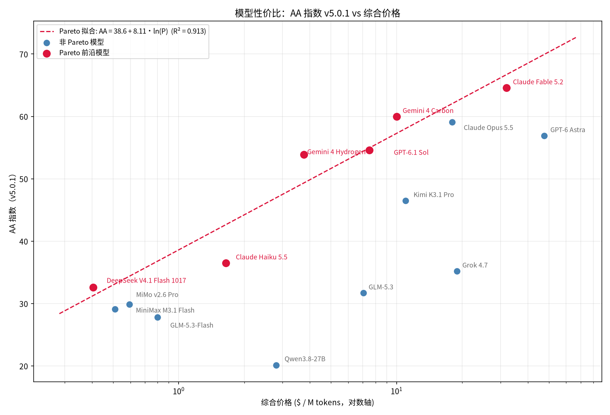

# 模型选择

数据收纳几类模型：

1. 闭源最强大模型。两个：Gemini 4 Carbon、Claude Fable 5.2。
2. 开源最强大模型。两个：Kimi K3.1 Pro和DeepSeek V4.1 Flash 1017。
3. 个人低成本独立部署。一个：Qwen3.8-27B。
4. 公司可离线部署。两个：GLM-5.3-Flash和Qwen3.8-Flash-Next。
5. 可执行任务廉价模型。两个：MiMo v2.6 Pro和MiniMax M3.1 Flash。

其中：

- 个人低成本部署的线，划定在了32G统一内存上。Q4量化的话，参数量大约在40-50B以下。
- 公司离线部署的线，划定在了256G统一内存上。Q4量化的话，参数量大约在300-400B以下。同时，激活参数量最好在20B以下。
- 可执行任务廉价模型，划定在 API 综合价格低于 $1/百万 tokens、具备 agent 或工具执行能力、且未归入上述任何类别的模型。

# 固有参数

| 模型 | 发布时间 | 开放性 | 参数量 | 激活参数量 | 多模态 | 上下文 | 下载 |
|---|---:|---:|---:|---:|---:|---:|---|
| [GPT-6 Astra](https://developers.openai.com/api/docs/models/gpt-6-astra) | 2026-09-03 | 闭 | -- | -- | V | 1M | -- |
| [GPT-6.1 Sol](https://developers.openai.com/api/docs/models/gpt-6.1-sol) | 2026-09-29 | 闭 | -- | -- | V | 1.05M | -- |
| [Claude Fable 5.2](https://www.anthropic.com/claude-fable-and-mythos-5-2) | 2026-11-09 | 闭 | -- | -- | V | 1M | -- |
| [Claude Opus 5.5](https://www.anthropic.com/claude-opus-5-5) | 2026-09-22 | 闭 | -- | -- | V | 1M | -- |
| [Claude Haiku 5.5](https://platform.claude.com/docs/en/models/haiku-5-5/overview) | 2026-10-07 | 闭 | -- | -- | V | 1M | -- |
| [Gemini 4 Carbon](https://blog.google/innovation-and-ai/models-and-research/gemini-models/introducing-gemini-4-carbon/) | 2026-10-28 | 闭 | -- | -- | V/A | 1M | -- |
| [Gemini 4 Hydrogen](https://blog.google/innovation-and-ai/models-and-research/gemini-models/introducing-gemini-4-hydrogen/) | 2026-11-12 | 闭 | -- | -- | V/A | 1M | -- |
| [Grok 4.7](https://x.ai/news/grok-4-7) | 2026-09-21 | 闭 | -- | -- | V | 500k | -- |
| [Kimi K3.1 Pro](https://www.kimi.ai/blog/kimi-k3-1-pro) | 2026-10-24 | 开 | 2.8T | 104B | V | 1M | [权重](https://huggingface.co/moonshotai/Kimi-K3.1-Pro) |
| [MiMo v2.6 Pro](https://mimo.mi.com/docs/zh-CN/news/latest/v2-6) | 2026-09-21 | 开 | 1.02T | 42B | V/A | 1M | [权重](https://huggingface.co/XiaomiMiMo/MiMo-V2.6-Pro-RL) · [GGUF](https://huggingface.co/ggml-org/MiMo-V2.6-Pro-RL-GGUF) |
| [GLM-5.3](https://z.ai/blog/glm-5.3) | 2026-08-14 | 开 | 744B | 40B | -- | 1M | [权重](https://huggingface.co/zai-org/GLM-5.3) · [GGUF](https://huggingface.co/unsloth/GLM-5.3-GGUF) |
| [GLM-5.3-Flash](https://z.ai/blog/glm-5.3-flash) | 2026-08-26 | 开 | 320B | 18B | V | 1M | [权重](https://huggingface.co/zai-org/GLM-5.3-Flash) · [GGUF](https://huggingface.co/unsloth/GLM-5.3-Flash-GGUF) |
| [DeepSeek V4.1 Flash 1017](https://huggingface.co/deepseek-ai/DeepSeek-V4.1-Flash-1017) | 2026-10-17 | 开 | 552B/763B | 8B/16B | V | 1M | [权重](https://huggingface.co/deepseek-ai/DeepSeek-V4.1-Flash-1017) · [GGUF](https://huggingface.co/unsloth/DeepSeek-V4.1-Flash-1017-GGUF) |
| [MiniMax M3.1 Flash](https://www.minimax.io/blog/minimax-m31f) | 2026-10-19 | 开 | 428B | 23B | V | 1M | [权重](https://huggingface.co/MiniMaxAI/MiniMax-M3.1-Flash) · [GGUF](https://huggingface.co/unsloth/MiniMax-M3.1-Flash-GGUF) |
| [Qwen3.8-Flash-Next](https://qwen.ai/blog?id=qwen3.8-flash-next) | 2026-08-26 | 开 | 180B | 6B | V | 262k | [权重](https://huggingface.co/Qwen/Qwen3.8-Flash-Next) · [GGUF](https://huggingface.co/unsloth/Qwen3.8-Flash-Next-GGUF) |
| [Qwen3.8-27B](https://qwen.ai/blog?id=qwen3.8) | 2026-08-14 | 开 | 27B | 27B | V | 262k | [权重](https://huggingface.co/Qwen/Qwen3.8-27B) · [GGUF](https://huggingface.co/unsloth/Qwen3.8-27B-GGUF) |

- 多模态列仅记录非文本输入：`V` 表示视觉（图像或视频），`A` 表示音频，`--` 表示仅支持文本输入。
- 我们目前无法百分百确认 Qwen3.8-Flash 的底层就是 Qwen3.8-Flash-Next，但是目前有很强证据证明二者是一回事。因此表格内采用 Qwen3.8-Flash-Next 的名字和固有参数、Qwen3.8-Flash 的价格，以及 Qwen3.8-Flash-Next 的 Benchmark 分数，并将其列为开源模型。
- DeepSeek V4.1 Flash 1017 的 552B 为 backbone 参数量，激活参数为 prefill 8B / decode 16B（因果编码器-解码器架构）；另含 196B Engram 条件记忆与视觉编码器，权重合计 763B。

# API 价格

| 模型 | 输入价格 | 输出价格 | 缓存读取 | 缓存写入 | 综合价格 |
|---|---:|---:|---:|---:|---:|
| GPT-6 Astra | \$10 | \$50 | \$1 | \$12.5 | \$47.5 |
| GPT-6.1 Sol | \$2 | \$10 | \$0.1 | \$2.5 | \$7.5 |
| Claude Fable 5.2 | \$8 | \$40 | \$0.20 | \$16 | \$32 |
| Claude Opus 5.5 | \$4 | \$20 | \$0.2 | \$8 | \$18 |
| Claude Haiku 5.5 | \$0.30 | \$1.50 | \$0.03 | \$0.60 | \$1.65 |
| Gemini 4 Carbon | \$4 | \$20 | \$0.2 | -- | \$10 |
| Gemini 4 Hydrogen | \$1.50 | \$7.50 | \$0.075 | -- | \$3.75 |
| Grok 4.7 | \$3 | \$9 | \$0.75 | -- | \$18.9 |
| Kimi K3.1 Pro | \$2 | \$10 | \$0.2 | \$4 | \$11 |
| MiMo v2.6 Pro | \$0.435 | \$0.87 | \$0.0036 | -- | \$0.594 |
| GLM-5.3 | \$1.4 | \$4.4 | \$0.26 | -- | \$7.04 |
| GLM-5.3-Flash | \$0.15 | \$0.5 | \$0.03 | -- | \$0.8 |
| DeepSeek V4.1 Flash 1017 | \$0.30 / \$0.15 | \$1.20 / \$0.60 | \$0.006 / \$0.003 | -- | \$0.405 |
| MiniMax M3.1 Flash | \$0.15 | \$0.60 | \$0.015 | -- | \$0.51 |
| Qwen3.8-Flash-Next | \$0.15 | \$0.47 | \$0.016 | -- | \$0.517 |
| Qwen3.8-27B | \$0.50 | \$3 | \$0.10 | -- | \$2.8 |

- 不参考套餐/批量折扣/限时优惠价格，表中采用官方原价。
- 综合价格按“0.1 × 输出价格 + 输入价格 + 20 × 缓存读取价格 + 缓存写入价格”计算。未提供缓存写入价格的 `--` 在本项计算中按 0 计。它表示实际载荷每处理 1M 输入 tokens 对应的真实成本：与这 1M 输入对应的输出、缓存读取和缓存写入量，分别按实际比例乘以各自单价后，与输入成本相加。
- 有峰谷价格的，综合价格按峰谷价的平均数计算。
- prompt长度会导致价格变化的模型，采用64K和256K两个点的价格，各50%混合。
- 对于缓存时间会导致价格变化的模型，按照30分钟计算。没有 30 分钟缓存档位时，采用能覆盖 30 分钟的最短档位。隐式缓存按命中价格计算，不保证保留 30 分钟。
- Gemini 4 Carbon 按标准原价记录；2026-11-13 核对[官方价格页](https://aistudio.google.com/docs/pricing#gemini-4-carbon)，优惠截至 2026-11-30，表中标准价自 2026-12-01 生效。
- Grok 4.7 的 prompt ≥200K 时输入/输出/缓存读取价格翻倍，Haiku 5.5 的 prompt >100K 时四项价格均为 5 倍，均已按两点混合。
- MiMo 和两款 GLM 的缓存写入/存储当前免费、未来价格未知，暂记 `--` 并按 0 计。
- Qwen 两款统一采用阿里国际区标准价及隐式缓存报价。

# 指标选择

指标选择的要求是有公信力（不好刷题），有区分度（没有饱和），数据齐全（模型都有）。下面是几个参考指标。缺失成绩记为 `--`。

- **[FrontierCode 2.0](https://artificialanalysis.ai/evaluations/frontiercode-2-0)**（表头 FrontierCode 2）：132 项真实开源仓库修改任务，通过测试与评分规则评价软件工程能力；阻断检查失败则该任务得零分。
- **[Terminal-Bench 4.0](https://artificialanalysis.ai/evaluations/terminalbench-4-0)**（表头 Terminal-Bench 4）：66 项真实终端任务，衡量实现、调试、环境操作与任务完成能力，与仓库修改互补。
- **[AutomationBench-AA](https://artificialanalysis.ai/evaluations/automationbench-aa)**（表头 AutomationBench）：657 项模拟 SaaS 工作流，衡量跨应用工具调用、业务规则执行和状态修改；触犯安全约束的任务得零分。
- **[HLE-Diamond](https://artificialanalysis.ai/evaluations/hle-diamond)**：1000 道高难问题，知识与推理各 500 题，包含图像题，不允许工具；采用总分，不混用旧版纯文本 HLE 或仅 Reasoning 子分。
- **[CritPt v2（Hard Subset）](https://artificialanalysis.ai/evaluations/critpt-v2)**（表头 CritPt v2 Hard）：允许离线代码执行的研究级物理难题；采用指数使用的 40 题困难子集，不混用 70 题全集或原版 CritPt。
- **[AA 指数 v5.0.1](https://artificialanalysis.ai/methodology/intelligence-benchmarking)**：九项评测构成的综合指标，独立保留。上述五项只是其中一部分，因此 AA 指数不是这五列的平均值；新旧版单项成绩也不能直接比较。

# Benchmark 数据

| 模型 | FrontierCode 2 | Terminal-Bench 4 | AutomationBench | HLE-Diamond | CritPt v2 Hard | AA指数 v5.0.1 | 性价比 |
|---|---:|---:|---:|---:|---:|---:|---:|
| [GPT-6 Astra](https://artificialanalysis.ai/models/gpt-6-astra) | 42.4% | 59.1% | 68.5% | 63.8% | 70.5% | 56.9 | 74.5% |
| [GPT-6.1 Sol](https://artificialanalysis.ai/models/gpt-6-1-sol) | 40.6% | 56.1% | 64.9% | 58.8% | 69.5% | 54.6 | **90.9%** |
| [Claude Fable 5.2 (with fallback)](https://artificialanalysis.ai/models/claude-fable-5-2) | 48.8% | 59.6% | 76.4% | 80.2% | 76.5% | 64.6 | **88.6%** |
| [Claude Opus 5.5 (with fallback)](https://artificialanalysis.ai/models/claude-opus-5-5) | 46.4% | 59.6% | 69.5% | 67.9% | 68.0% | 59.1 | 87.2% |
| [Claude Haiku 5.5](https://artificialanalysis.ai/models/claude-haiku-5-5) | 34.9% | 32.8% | 35.4% | 29.6% | 43.5% | 36.5 | **78.3%** |
| [Gemini 4 Carbon](https://artificialanalysis.ai/models/gemini-4-carbon) | 40.6% | 65.2% | 77.8% | 69.1% | 69.0% | 60.0 | **95.9%** |
| [Gemini 4 Hydrogen](https://artificialanalysis.ai/models/gemini-4-hydrogen) | 39.0% | 53.5% | 76.1% | 58.8% | 66.0% | 53.9 | **100.0%** |
| [Grok 4.7](https://artificialanalysis.ai/models/grok-4-7-high) | 27.8% | 24.7% | 63.5% | 23.6% | 37.0% | 35.2 | 51.6% |
| [Kimi K3.1 Pro](https://artificialanalysis.ai/models/kimi-k3-1-pro) | 25.5% | 67.2% | 73.3% | 37.3% | 49.5% | 46.5 | 73.3% |
| [MiMo v2.6 Pro](https://artificialanalysis.ai/models/mimo-v2-6-pro) | 24.0% | 34.8% | 58.6% | 15.2% | 34.0% | 29.9 | 79.6% |
| [GLM-5.3](https://artificialanalysis.ai/models/glm-5-3) | 21.6% | 41.9% | 62.2% | 17.9% | 33.5% | 31.7 | 53.3% |
| [GLM-5.3-Flash](https://artificialanalysis.ai/models/glm-5-3-flash) | 17.6% | 32.8% | 60.4% | 18.2% | 24.5% | 27.8 | 69.1% |
| [DeepSeek V4.1 Flash 1017](https://artificialanalysis.ai/models/deepseek-v4-1-flash-1017) | 28.5% | 33.8% | 66.6% | 25.3% | 25.0% | 32.6 | **95.4%** |
| [MiniMax M3.1 Flash](https://artificialanalysis.ai/models/minimax-m3-1-flash) | 20.8% | 25.8% | 72.5% | 28.1% | 32.5% | 29.1 | 80.4% |
| [Qwen3.8-Flash-Next](https://artificialanalysis.ai/models/qwen3-8-flash-next) | -- | 25.3% | 55.9% | 16.3% | -- | -- | -- |
| [Qwen3.8-27B](https://artificialanalysis.ai/models/qwen3-8-27b) | 14.9% | 5.6% | 48.2% | 15.3% | 4.0% | 20.1 | 39.2% |

- 数据核查日期：2026-11-05；AA 指数版本：v5.0.1。表中 AA 指数保留一位小数。
- 数据优先采用AA独立评测，其次采用官方模型卡/报告。两者均不存在时，参考采信第三方评价或官方估计值。
- 表中成绩使用对应的最高推理档位；Claude Fable 5.2、Opus 5.5 的 AA 评测启用了默认 fallback，因此单独标注。

## 性价比

- 性价比使用上文 API 价格区块的综合价格与本区块的 AA 指数计算。
- 性价比从当前表中选出“相同或更低综合价格下不存在更高 AA 指数模型”的全部 Pareto 前沿模型，拟合得到性价比预测线。然后计算每个模型的 AA 指数相对预测指数的百分比，再对总体归一化。归一化采用所有模型性价比乘以当前模型集合中最高原始性价比的倒数，使最高分恰为 100%，其余分数均落在 0–100% 区间。性价比是当前模型集合内的相对比较，模型或价格变化后需要重新筛选 Pareto 前沿并整体重算。
- 当前拟合得到的性价比预测线为 `预期 AA 指数 = 38.6029 + 8.1112 × ln(综合价格)`（R² = 0.913）。归一化为 `实际 AA 指数 / 预期 AA 指数 × 91.5100%`。
- Qwen3.8-Flash-Next 缺少 AA v5.0.1 指数，性价比记为 `--`，不参与拟合与绘图。图中包含尚未公开开放的 Carbon，因此 Pareto 前沿不等同于当前可用 API 的采购建议。
- Pareto模型的性价比已经被加粗。
- 价格-AA 关系图（横轴为对数综合价格，纵轴为 AA 指数，红点为 Pareto 前沿模型，红色虚线为 Pareto 拟合线）：

  

# 用户反馈收集

- GPT-6 Astra的评价极度两极分化。
- GPT-6.1 Sol明显有价格优势。但是好坏波动大，所以一直有降智传言。
- Opus 5.5反馈逆天，号称“全球最好用模型”，“老实干活儿的老二回来了，还当了老大”。
- Haiku 5.5长任务、跨轮记忆都比较差，失败循环与长上下文可能吃掉价格优势。
- Grok被吐槽“只有NSFW是刚需”。而且这批人还在流向Qwen3.8-27B。
- Kimi K3.1 Pro，复杂后端实现、原型和视觉设计反馈良好，部分用户认为接近 Opus。缺点是慢、工具使用弱、过度复杂化。订阅额度消耗投诉突出。
- MiMo v2.6 Pro中评偏差。评价是“性价比高跑分漂亮，然而不能干活儿”。
- GLM-5.3/GLM-5.3-Flash好评。前者便宜，后者可本地部署。缺点是不知为何，坚信自己是claude。
- DeepSeek V4.1 Flash 1017优点是速度快，编码能接受，较此前版本明显改善。但仍有幻觉问题，固执，啰里八嗦。不同供应商是否跑相同版本存疑。
- MiniMax M3.1 Flash的评价是，能干活，但速度与 provider 体验分化。差评包括过度思考、大量零碎工具调用、简单任务耗时长。
- Qwen3.8-Flash-Next意外的强。但只有一个供应商。
- Qwen3.8-27B，低成本本地执行的唯一选择，也无需在意评价了。

# 点评

- 评测升级到5之后，很多模型评分就大幅降低了。
- 最强阵营里，Opus 5.5的领先位置被大幅降低，又恢复了御三家混战的格局。
- Fable 5.2 的 AA v5.0.1 指数为 64.6，超过 Carbon 的 60.0 和 Opus 5.5 的 59.1，成为本表最高分，但综合价格也升至 $32。
- Kimi K3.1 Pro 的 AA v5.0.1 指数为 46.5，在本表 16 款模型中排名第七，是表内开放权重模型最高分，已经进入最强阵营的混战中。
- 第二集群里，GLM-5.3 的 AA 指数被 DeepSeek V4.1 Flash 1017 反超。这个集群实际上已经没什么价值了。
- 高性价比部分。MiMo v2.6 Pro 的评分被大幅下调，反而落后于 DeepSeek V4.1 Flash 1017 了。DeepSeek V4.1 Flash 1017 直接封神。
- Qwen3.8-27B自己一桌吃饭，地位始终无人挑战。
